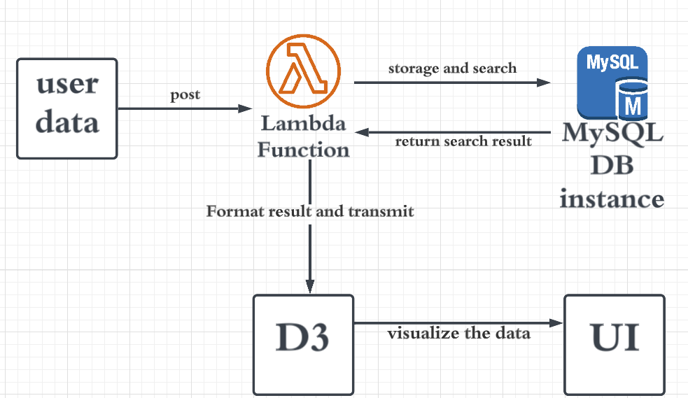
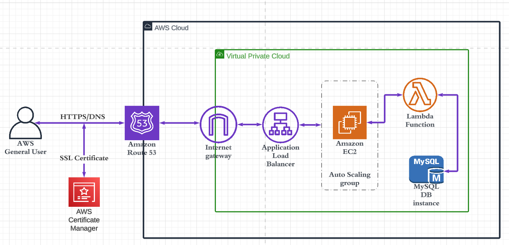
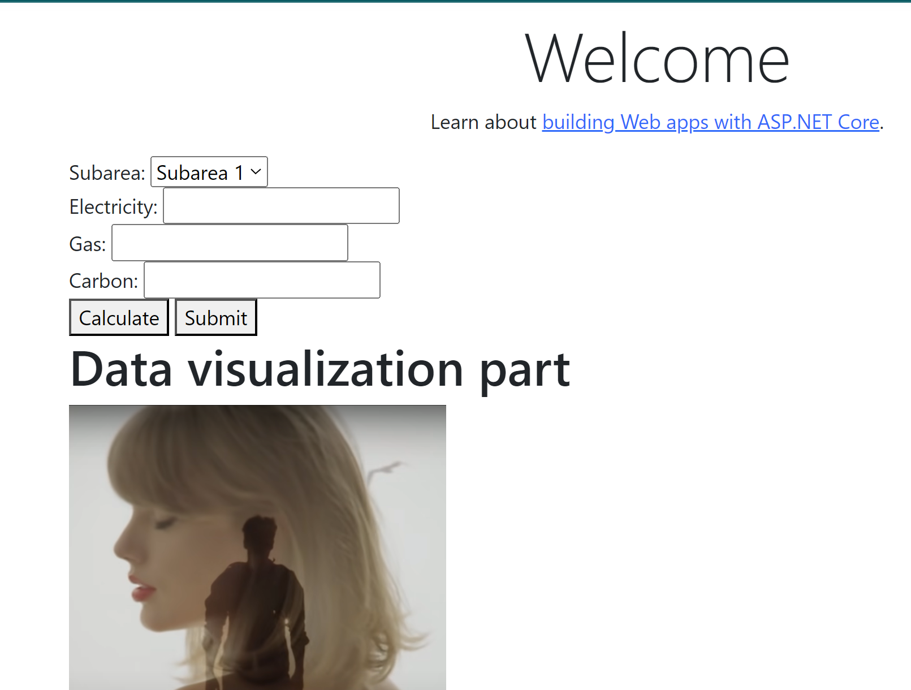
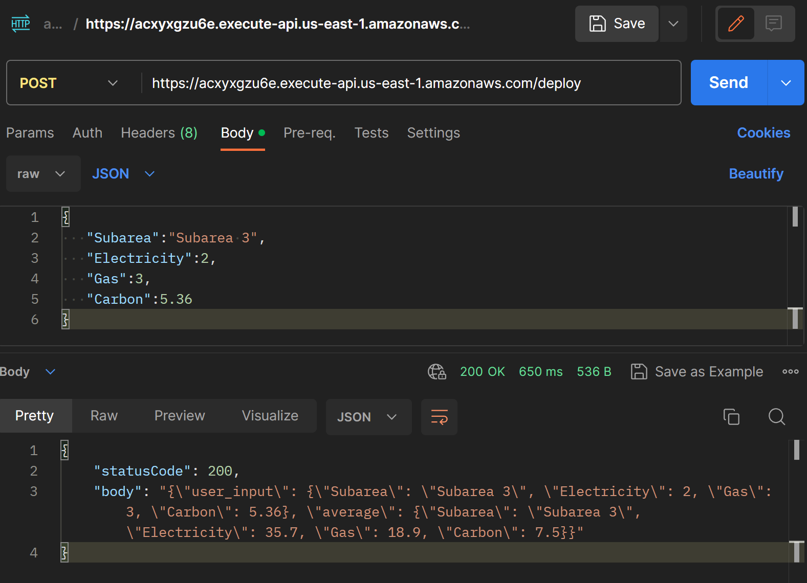
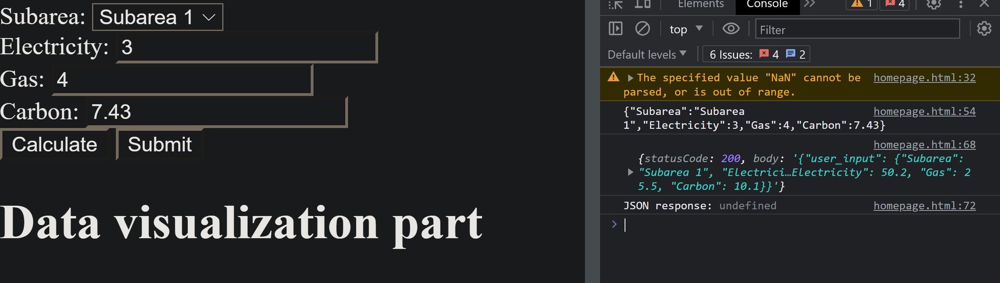

# FIT5120TP9
project for FIT5120 onboarding project week 1-3  
[project link](https://carbonvic.fit5120-tp9-23-s2.online/)  
```
username: guest
password: guest
```
# tech stake
## BACKEND
.net core mvc to host the web application   
[Download .NET 6.0 (Linux, macOS, and Windows)](https://dotnet.microsoft.com/en-us/download/dotnet/6.0)  
aws lambda to process the data and matching with database   
[What is AWS Lambda? - AWS Lambda](https://docs.aws.amazon.com/lambda/latest/dg/welcome.html)  

## DB
Amazon rds mysql to storage the required open dataset  
[Hosted MySQL - Amazon RDS for MySQL - AWS](https://aws.amazon.com/rds/mysql/)  
# Project overview
## Application Architecture

## cloud architecture 
[Hardening the security of your AWS Elastic Beanstalk Application the Well-Architected way | AWS Security Blog](https://aws.amazon.com/blogs/security/hardening-the-security-of-your-aws-elastic-beanstalk-application-the-well-architected-way/)  

## Project folder  
### the web application  
`.\FIT5120TP9\coremysqlhttps` [git repo](https://github.com/GreenH47/FIT5120TP9/tree/main/coremysqlhttps/carbonvic)  
use vs studio click the `.sln` file to identify the project  
### Database connection
`.\FIT5120TP9\dbtest\dbtest.py` [py file](https://github.com/GreenH47/FIT5120TP9/blob/main/dbtest/dbtest.py) 
the user with password and the endpoint is inside this script. you can modify with your own key.  
## lambda function  
`C:\Git\FIT5120TP9\lambda-function` the lambda function to process the user input and transmit the match result with db.  

# Database  
## strcuture  
```sql
use test;
CREATE TABLE bill (  
   id INT AUTO_INCREMENT PRIMARY KEY,  
   subarea VARCHAR(100),  
   electricity FLOAT,  
   gas FLOAT,  
   carbon FLOAT  
);
```
## data template
```sql
use test;
INSERT INTO bill (subarea, electricity, gas, carbon)  
VALUES  
   ('Subarea 1', 50.2, 25.5, 10.1),  
   ('Subarea 2', 40.1, 20.3, 8.2),  
   ('Subarea 3', 35.7, 18.9, 7.5);
```
## Database connection
`.\FIT5120TP9\dbtest\dbtest.py` [py file](https://github.com/GreenH47/FIT5120TP9/blob/main/dbtest/dbtest.py) 
the user with password and the endpoint is inside this script. you can modify with your own key.  

# Web application
## frontend
 [coremysqlhttps/frontend](https://github.com/GreenH47/FIT5120TP9/tree/main/coremysqlhttps/frontend)
 the user input form and data visualization will be hold in the same page  
 ==you need modify this file to apply the ui design and visualization== 
 
## where to begin your work

## how the code work behind  
when click the submit button. the `generateJSON()` fuction will trigger to format user input to the lambda function with the format like 
```json
{
   "Subarea":"Subarea 3",
   "Electricity":2,
   "Gas":3,
   "Carbon":5.36
}
```
to the lambda function in the cloud.   
lambda api use post method to get json request `https://acxyxgzu6e.execute-api.us-east-1.amazonaws.com/deploy`  
postman api test result  


website test result  

if there is data matched in the database, it will return  
```json
{
   "user_input":{
      "Subarea":"Subarea 3",
      "Electricity":2,
      "Gas":3,
      "Carbon":5.36
   },
   "average":{
      "Subarea":"Subarea 3",
      "Electricity":35.7,
      "Gas":18.9,
      "Carbon":7.5
   }
}
```
otherwise it will return  
```json
{
   "user_input":{
      "Subarea":"Subarea 4",
      "Electricity":2,
      "Gas":3,
      "Carbon":5.36
   },
   "average":null
}
```

the `sendDataToAPI(jsonString)` will send the user input to the lambda and process any response from it. 

for the data visualization function. it will receive the json object from the `sendDataToAPI(jsonString)` function 
