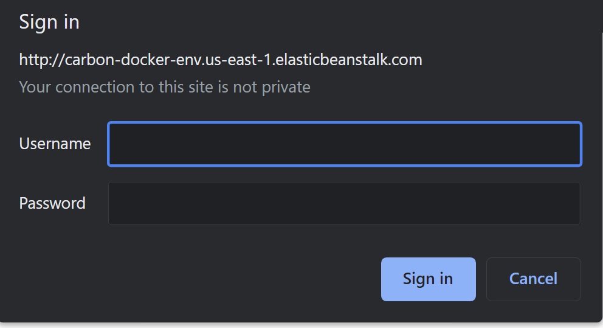

# Password protection
1. ssh to ec2 instance running your app ([Remote - SSH](https://marketplace.visualstudio.com/items?itemName=ms-vscode-remote.remote-ssh)) 
2. Use the `cat` command to view the contents of the Nginx configuration file(s) `cat /etc/nginx/nginx.conf` and modify it `sudo nano /etc/nginx/nginx.conf`  
3.  modify the `server` block in your `nginx.conf` file  
```
server {
    ...
    
    location / {
        auth_basic "Restricted Access";                     # Define the authentication realm
        auth_basic_user_file /etc/nginx/.htpasswd;          # Specify the password file location
        
        ...

```
4. Update the package list and install the Apache utilities package that includes `htpasswd`: `sudo yum update` and `sudo yum install httpd-tools`  
5. `sudo htpasswd -c /etc/nginx/.htpasswd <username>` use the `htpasswd` command to generate the password file and add users 
6. Restart the Nginx service to apply the new configuration `sudo service nginx restart` 


# Https and SSL
[Elastic Beanstalk Route 53 Domain + SSL/HTTPS (2020) [Episode #2] - YouTube](https://www.youtube.com/watch?v=BeOKTpFsuvk)  
1. buy a domain and use ACM to get SSL certificate for your domain 
2. enable https listener in your ALB 
3. create A name and apply alias record in your hosted zone  

# Deploy docker image into aws 
[Deploying Elastic Beanstalk applications from Docker containers - AWS Elastic Beanstalk](https://docs.aws.amazon.com/elasticbeanstalk/latest/dg/create_deploy_docker.html)
1. package and test your image local 
2. push the image to your docker hub 
3. create file `Dockerrun.aws.json` and follow this templete 
```json
{
  "AWSEBDockerrunVersion": "1",
  "Image": {
    "Name": "your-docker-image:tag",
    "Update": "true"
  },
  "Ports": [
    {
      "ContainerPort": 80,
      "HostPort": 8080
    }
  ]
}

```
  
this file equivalent to  
```bash
sudo apt update
sudo apt install docker.io

docker pull dockerhub-username/repository-name:tag

docker run -d -p <host-port>:<container-port> dockerhub-username/repository-name:tag

```
4. in [Website & Web App Deployment - AWS Elastic Beanstalk - AWS](https://aws.amazon.com/elasticbeanstalk/) console select docker platform and upload `Dockerrun.aws.json` file. 
5. configure other option like add ALB and enable 443 https listener or vpc 
6. deploy and examine your app in public access  
